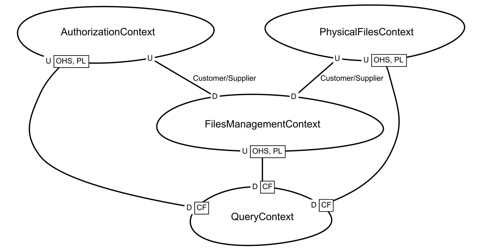
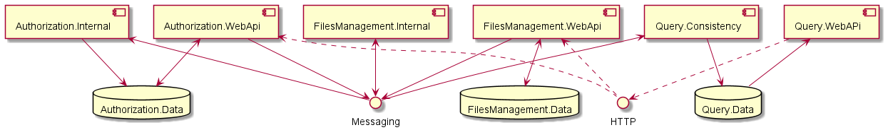

# Что?

Демонстрационный проект для резюме. Не стоит ожидать от проекта "реалистичности", так как я один не смогу за достаточно
короткий срок сделать полноценный сервер. Но можно примерно понять, что ожидать от моей работы.

# Зачем?

На собеседованиях часто просят показать предыдущий проект. Их небезопасно или незаконно показывать. Кроме того, они
содержат работу других людей. Поэтому я начал делать этот проект, над которым работаю я один.

# Почему…

## …не всё реализовано?

Для разработки с нуля времени уходит достаточно много, поэтому я не успел всё реализовать.

## …классы сущностей предметной области реализованы так?

В этом проекте я рассматривал два метода моделирования сущностей:

- в виде изменяющихся объектов;
- в виде последовательности неизменяемых снимков.

Под изменяемыми объектами я
понимаю ["обычную" реализацию](https://docs.microsoft.com/en-us/dotnet/architecture/microservices/microservice-ddd-cqrs-patterns/net-core-microservice-domain-model#implement-domain-entities-as-poco-classes)
.

### Моделирование с помощью неизменяемых снимков

#### Основа

Один из популярных методов моделирования на основе _изменяемых_ объектов, заключается в том, что для выполнения
какого-то действия публикуется команда, в результате выполнения которой модель порождает событие, которое затем приводит
к её обновлению (как это сделано в [EventFlow](https://github.com/eventflow/EventFlow)):

```c#
record ChangePropertyCommand(long Id, string Value);

record PropertyChangedEvent(string Value);

class Model
{
    public Model(long id, string property)
    {
        Id = id;
        Property = property;
    }

    public long Id { get; }
    public string Property { get; private set; }

    public void ChangeProperty(string value, IEventPublisher publisher)
    {
        // Validation…

        var @event = new PropertyChangedEvent(value);
        publisher.Publish(@event);
        Apply(@event);
    }

    public void Apply(PropertyChangedEvent @event)
    {
        Property = @event.Value;
    }
}

interface IEventPublisher
{
    public void Publish(object @event);
}

interface IModelRepository
{
    public Model Get(long id);
    public void Update(Model model);
}

class CommandPublisher
{
    public CommandPublisher(IModelRepository repository, CommandExecutor commandExecutor)
    {
        _repository = repository;
        _commandExecutor = commandExecutor;
    }

    private readonly IModelRepository _repository;
    private readonly CommandExecutor _commandExecutor;

    public void Publish(ChangePropertyCommand command)
    {
        var model = _repository.Get(command.Id);
        _commandExecutor.Execute(model, command);
        _repository.Update(model);
    }
}

class CommandExecutor
{
    public CommandExecutor(IEventPublisher eventPublisher)
    {
        _eventPublisher = eventPublisher;
    }

    private readonly IEventPublisher _eventPublisher;

    public void Execute(
        Model model,
        ChangePropertyCommand command)
    {
        model.ChangeProperty(command.Value, _eventPublisher);
    }
}

static void Usage(
    IModelRepository repository,
    CommandPublisher commandPublisher,
    long modelId)
{
    commandPublisher.Publish(new ChangePropertyCommand(modelId, "NewValue1"));
    commandPublisher.Publish(new ChangePropertyCommand(modelId, "NewValue2"));
    var model = repository.Get(modelId);
}
```

Идея иметь изменяемые объекты в столь важном месте мне не очень нравится, поэтому я искал способ моделирования с помощью
неизменяемых объектов. В первом приближении это достаточно просто реализуется:

```c#
record ModelSnapshot
{
    public static ModelSnapshot Create(long id) 
        => new(id, "DefaultValue");

    private ModelSnapshot(long id, string property)
    {
        Id = id;
        Property = property;
    }

    public long Id { get; }
    public string Property { get; private set; }

    public ModelSnapshot ChangeProperty(string value) {
        // Validation…

        return this with { Property = value };
    }
}

static void Usage()
{
    var model = ModelSnapshot.Create(0);
    model = model.ChangeProperty("NewValue");
    model = model.ChangeProperty("NewValue2");
    …
}
```

Затем я добавил события:

```c#
abstract record ModelEvent
{
    private ModelEvent() {}

    public sealed record Created(long Id) : ModelEvent;

    public sealed record PropertyChanged(string Value) : ModelEvent;
}

record ModelSnapshot
{
    public static ModelEvent.Created Create(long id)
        => new(id);

    public static ModelSnapshot After(ModelEvent.Created @event)
        => new(@event.Id, "DefaultValue");

    private ModelSnapshot(long id, string property)
    {
        Id = id;
        Property = property;
    }

    public long Id { get; }
    public string Property { get; private set; }

    public ModelEvent.PropertyChanged ChangeProperty(string value) {
        // Validation…

        return new ModelEvent.PropertyChanged(value);
    }

    public ModelSnapshot After(ModelEvent.PropertyChanged @event)
        => this with { Property = @event.Value };
}

static void Usage()
{
    var model = ModelSnapshot.After(ModelSnapshot.Create(0));
    model = model.After(model.ChangeProperty("NewValue"));
    model = model.After(model.ChangeProperty("NewValue2"));
}
```

Такой способ моделирования имеет приятные преимущества:

- все преимущества неизменяемых объектов (потоковая безопасность, безопасность передачи в другие части системы),
- нет необходимости создавать отдельные классы для представления снимков, так как модель уже создана в виде их
  последовательности,
- нет необходимости в дополнительном моделировании событий, если в качестве способа хранения
  выбран [Event sourcing](https://docs.microsoft.com/en-us/azure/architecture/patterns/event-sourcing).

Я решил, что публикацию событий нет смысла включать в слой предметной области. Пусть слой приложения сам решает нужно
публиковать событие или нет:

```c#
static void Usage(IEventPublisher eventPublisher)
{
    var created = ModelSnapshot.Create(0);
    eventPublisher.Publish(created);
    var model = ModelSnapshot.After(created);

    var propertyChanged1 = model.ChangeProperty("NewValue");
    eventPublisher.Publish(propertyChanged1);
    model = model.After(propertyChanged1);

    var propertyChanged2 = model.ChangeProperty("NewValue2");
    eventPublisher.Publish(propertyChanged2);
    model = model.After(propertyChanged2);
}
```

#### Хранение

Также я хотел сделать выполнение операций более простым для понимания и чтения. Поэтому я решил не извлекать команды
изменения модели и их исполнение в отдельные объекты, чтобы синтаксис использования не сильно отличался от
использования "обычных" объектов. Для этого можно попробовать использовать наследование, но это сделало бы снимки модели
зависимыми от контекста выполнения, что свело бы на нет все преимущества:

```c#
record ModelPropertyChangedEvent(long Id, string Value);

abstract record ModelSnapshot
{
    protected ModelSnapshot(long id, string property)
    {
        Id = id;
        Property = property;
    }

    public long Id { get; }
    public string Property { get; private set; }

    public ModelPropertyChangedEvent ChangeProperty(string value)
    {
        // Validation…
        
        return new ModelPropertyChangedEvent(Id, value);
    }

    protected abstract ModelPropertyChangedEvent ExecuteChangeProperty(string value);

    public ModelSnapshot After(ModelPropertyChangedEvent @event) => this with { Property = @event.Value };
}

record EFModelSnapshot : ModelSnapshot
{
    public EFModelSnapshot(long id, string property)
        : base(id, property)
    {
    }

    internal DbContext DbContext { get; set; }

    protected override ModelPropertyChangedEvent ExecuteChangeProperty(string value)
    {
        var data = DbContext.Find(…);
        // Update data…
        DbContext.Update(data);
        DbContext.SaveChanges();

        return new ModelPropertyChangedEvent(Id, value);
    }
}
```

Поэтому я выбрал очевидное решение: извлечь реализацию в отдельный класс и выполнять её инъекцию в методы модели. Для
улучшения инкапсуляции можно скрыть реализацию от пользователя модели, используя `protected internal`:

```c#
public abstract record ModelEvent
{
    private ModelEvent()
    {
    }

    public sealed record Created(long Id) : ModelEvent;

    public sealed record PropertyChanged(long Id, string Value) : ModelEvent;
}

record ModelSnapshot
{
    public static ModelEvent.Created Create(IContext context)
    {
        // Validation…

        return context.ExecuteCreate();
    }

    public static ModelSnapshot After(ModelEvent.Created @event) 
        => new ModelSnapshot(@event.Id, "DefaultValue");

    private ModelSnapshot(long id, string property)
    {
        Id = id;
        Property = property;
    }

    public long Id { get; }
    public string Property { get; private set; }

    public ModelEvent.PropertyChanged ChangeProperty(
        IContext context,
        string value)
    {
        // Validation…

        return context.ExecuteChangeProperty(Id, value);
    }

    public ModelSnapshot After(ModelEvent.PropertyChanged @event)
        => this with { Property = @event.Value };

    public interface IContext
    {
        protected internal ModelEvent.Created ExecuteCreate();

        protected internal ModelEvent.PropertyChanged ExecuteChangeProperty(long id, string value);
    }
}

class ModelData
{
    public long Id { get; }
    public string Property { get; set; }
}

record EFModelContext : ModelSnapshot.IContext
{
    public EFModelContext(DbContext dbContext)
    {
        _dbContext = dbContext;
    }

    private readonly DbContext _dbContext;

    ModelEvent.Created ModelSnapshot.IContext.ExecuteCreate()
    {
        var data = new ModelData();
        _dbContext.Add(data);
        _dbContext.SaveChanges();

        return new ModelEvent.Created(data.Id);
    }

    ModelEvent.PropertyChanged ModelSnapshot.IContext.ExecuteChangeProperty(
        long id,
        string value)
    {
        var data = _dbContext.Find() as ModelData;
        data.Property = value;
        _dbContext.Update(data);
        _dbContext.SaveChanges();

        return new ModelEvent.PropertyChanged(id, value);
    }
}

static void Usage(ModelSnapshot.IContext context)
{
    var model = ModelSnapshot.After(ModelSnapshot.Create(context));
    model = model.After(model.ChangeProperty(context, "NewValue1"));
    model = model.After(model.ChangeProperty(context, "NewValue2"));
}
```

В данном случае сохраняются сами снимки, но это легко заменяется на хранение событий или на комбинацию этих двух
методов.

#### Сравнение

Далее следовало решить как должен вести себя `Equals`. Поведение я выбирал из очевидных вариантов:

- ссылочное сравнение;
- сравнение по значению;
- сравнение по идентификатору.

Сравнение по идентификатору я счёл сразу плохой идеей, так как такая реализация приводит к трудно читаемому коду,
например:

```c#
record ModelSnapshot(long Id, string Property)
{
    public ModelSnapshot ChangeProperty(string value)
        => this with { Property = value };

    public override int GetHashCode() => Id.GetHashCode();

    public virtual bool Equals(ModelSnapshot? other)
        => other is not null && Id == other.Id;
}

public static void Usage()
{
    IImmutableList<ModelSnapshot> models = …;

    var model = models.First();
        
    model = model.ChangeProperty("NewValue");
    // Выглядит как ошибка.
    models = models.Remove(model).Add(model);
    
    model = model.ChangeProperty("NewValue2");
    // Выглядит как ошибка.
    models = models.Replace(model, model);
}
```

Сравнение по значению имеет смысл только для корня агрегата, так как идентификаторы других сущностей локальны в границах
агрегата. Поэтому придать какой-то смысла такому сравнению я не смог. Корневые сущности имеет смысл сравнивать:
неравенство означало бы, что агрегат имел различные состояния в разные моменты времени. Я решил такую реализацию не
использовать, так как это достаточно бесполезная информация. И даже если такое будет нужно, это легко реализовать с
помощью `IEqualityComparer<ModelSnapshot>`.

Другой интересный вариант можно рассмотреть, если снимки корневой сущности содержат _"время"_, когда они были сделаны.
Тогда сравнение можно реализовать полноценно
(равенство означает, что это один и тот же снимок):

```c#
record ModelSnapshot(long Id, string Property, int Version = 0)
{
    public ModelSnapshot ChangeProperty(string value) {
        // Validation…

        // Проверка того, что версия в хранилище равна версии снимка.
    
        return this with { Property = value, Version = Version + 1 };
    }

    public override int GetHashCode()
        => HashCode.Combine(Id, Version);

    public virtual bool Equals(ModelSnapshot? other)
        => other is not null 
            && Id == other.Id 
            && Version == other.Version;
}
```

_В этом случае время снимка смоделировано свойством `Version`, которое считает количество изменений, но можно
использовать "реальное" время `DateTime`, внешний `ConcurrencyToken` и тому подобное._

Учитывая описанные недостатки, я пришёл к выводу, что лучше сделать однообразные правила сравнения сущностей, и выбрал
сравнение по ссылке.

#### Итог

Такой способ реализации был сделан для нескольких агрегатов:
[Storage](Demo.Files.FilesManagement.Domain.Abstractions/StorageAggregate/Storage.cs),
[User](Demo.Files.Authorization.Domain.Abstractions/UserAggregate/User.cs).

Ошибки я представил в виде исключений, для более быстрой реализации, но при необходимости их можно возвращать из методов
модели.

Я сделал для демонстрации несколько реализаций:

- хранение в памяти, используя шаблон Event sourcing:
    - [StorageContext](Demo.Files.FilesManagement.Domain.Adapters.Context.Testing/StorageAggregate/StorageContext.cs)
    - [UserContext](Demo.Files.Authorization.Domain.Adapters.Context.Testing/UserAggregate/UserContext.cs)
- хранение снимков в базе данных, используя Entity Framework:
    - [StorageWriteContext](Demo.Files.FilesManagement.Domain.Adapters.Context.EntityFramework/StorageAggregate/StorageWriteContext.cs)
    - [StorageReadContext](Demo.Files.FilesManagement.Domain.Adapters.Context.EntityFramework/StorageAggregate/StorageReadContext.cs)
    - [UserWriteContext](Demo.Files.Authorization.Domain.Adapters.Context.AspIdentity/UserAggregate/UserWriteContext.cs)
    - [UserReadContext](Demo.Files.Authorization.Domain.Adapters.Context.AspIdentity/UserAggregate/UserReadContext.cs)

## …идентификаторы представлены интерфейсами?

Для эксперимента я очень хотел сделать модель полностью независимой от технических деталей реализации (способа хранения,
кэширования, отображения). Это популярная идея, которую уже много раз пытались реализовать. Но, как мне кажется, делали
это слишком уступчиво:

- делали ограничение, что только `Guid` может быть использован в качестве идентификатора (чтобы была возможность его
  создать до сохранения модели в хранилище);
- разрешали создавать модель без идентификатора вообще, и "незаметно" устанавливать его после того, как он будет
  сгенерирован внешней системой;
- обязывали использовать базовый класс, в котором скрывают технические детали.

Я хотел сделать более строгую реализацию. И если последние две проблемы отпали, при использовании описанной выше
реализации, то проблема с независимостью от типа идентификатора всё ещё оставалась. Первая моя мысль заключалась в
добавление типа-параметра идентификатора для модели, как это делается в ASP.NET Identity:

```c#
class IdentityUser<TKey> where TKey : IEquatable<TKey> {
    …
}
```

Но это решение слишком плохо масштабировалось, так как агрегат мог взаимодействовать и с другими сущностями, что
заставило бы добавить несколько типов-параметров, а это слишком неудобно использовать.

Вторая идея была использовать "универсальную" реализацию:

```c#
record ModelId(object Value);
```

Это рабочий вариант, но он имеет несколько недостатков:

- абстрактная модель имеет доступ к значению, хотя не должна от него зависеть;
- будет происходить упаковка, если в качестве `Value` используется тип-значение.

Выполнять упаковку не хотелось, поэтому я остановился на идее с интерфейсом:

```c#
interface IModelId : IEquatable<IModelId> { }

// Реализация.
record EFModelId(long Value) : IModelId
{
    public virtual bool Equals(IModelId? other)
        => other is EFModelId && Equals(other);
}

static class EFModelIdExtensions
{
    [return: NotNullIfNotNull("this")]
    public static EFModelId? Concrete(this IModelId? @this)
        => (EFModelId?)@this;
        
    public static long RawLong(this IModelId @this)
        => @this.Concrete().Value;
}
```

Так как в одном проекте есть смысл использовать только одну реализацию, то, используя методы расширения, можно безопасно
получать доступ к внутреннему представлению.

## …не используются паттерн [Repository](http://ddd.fed.wiki.org/view/repositories)?

Этот паттерн предполагает создание иллюзии коллекции объектов. Построение иллюзии обычно очень сложно, так как это либо
приводит к очень сложному коду для поддержания иллюзии, либо иллюзия становится всё более прозрачной, что уменьшает
выгоду от её использования. Создание качественной иллюзии часто экономически неэффективно. Поэтому было принято решение,
не делать иллюзию вовсе. Вместо этого можно использовать именованный конструктор в паре с абстракцией контекста чтения:

```c#
class Model
{
    public static Task<Model?> FindByIdAsync(IReadContext context, long id) 
        => context.FindByIdAsync(id);

    public interface IReadContext
    {
        protected internal Task<Model?> FindByIdAsync(long id);
    }
}
```

Это может выглядит так, будто интерфейс репозитория переместили внутрь класса модели и ограничили к нему доступ через
именованный конструктор. Технически это можно так и рассматривать, но важным отличием является то, что больше нет
иллюзии коллекции и получение экземпляра существующей модели синтаксически не отличается от её создания. Кроме того, в
контекст можно спокойно добавлять методы, которые не должны быть видны клиентам модели, что, в случае с репозиторием,
сделало бы иллюзию более прозрачной.

## …не используются паттерн [Service](http://ddd.fed.wiki.org/view/services)?

Сама идея извлечения метода из класса модели очень интересна, и в экстремальном варианте (когда все методы представлены
в виде сервисов) приводит к модели, в которой состояние и поведение разделены между разными объектами:

```c#
// "Обычная" модель в виде объкта. 
class ClosedModel
{
    public static ClosedModel Create() => new ClosedModel();

    private ClosedModel(long id)
    {
        Id = id;
    }

    public long Id { get; }

    public string Property1 { get; private set; }

    public void ChangeProperty1(string value) => Property1 = value;

    public long Property2 { get; private set; }

    public void ChangeProperty2(long value) => Property2 = value;
}

// Модель, в которой состояние и поведение разделены. 
class ServiceModel
{
    internal ServiceModel(long id)
    {
        Id = id;
    }

    public long Id { get; }

    public string Property1 { get; internal set; }

    public long Property2 { get; internal set; }
}

class CreateService
{
    public ServiceModel Execute() => new ServiceModel();
}

class ChangeProperty1
{
    public void Execute(ServiceModel model, string value) => model.Property1 = value;
}

class ChangeProperty2
{
    public void Execute(ServiceModel model, long value) => model.Property2 = value;
}

static void Usage()
{
    var closedModel = ClosedModel.Create();
    closedModel.ChangeProperty1("Value1");
    closedModel.ChangeProperty2(123);

    var serviceModel = new CreateService().Execute();
    new ChangeProperty1().Execute(serviceModel, "Value1");
    new ChangeProperty2().Execute(serviceModel, 123);
}
```

Такое разделение противоречит идеям DDD, в контексте которого обычно рассматривают только моделирование с помощью
класса, который содержит и данные, и поведение (в соответствии с идеями ООП). Поэтому сервисы в DDD часто используются
как обходные пути в реализации, когда поведение не удалось уместить в какой-то объект модели.

Такое разделение поведения и состояния имеет смысл, и его будет удобно использовать при качественном оформлении. Этот
случай не стоит рассматривать как [AnemicDomainModel](https://www.martinfowler.com/bliki/AnemicDomainModel.html), так
как состояние и поведение всё ещё сильно связаны и находятся вместе, просто реализация инкапсуляции стала более
абстрактной и вышла за границы одного класса.

Однако в этом проекте я решил попробовать пойти в обратном направлении и приложить все усилия, чтобы разместить
поведении в классе модели, даже тогда, когда для этого обычно используют сервис. С целью сделать процесс использования
модели максимально похожим на использование "обычных" объектов.

## …тесты моделей предметной области находятся в абстрактных классах?

Очевидно, что тестировать мы в любом случае будем какую-нибудь реализацию (пусть даже представленную в виде заглушек).
При этом тесты модели должны выполняться для любой реализации и, чтобы избежать дублирования, логично представить их в
виде отдельных классов. А так как тестируется абстрактная модель, то и тесты можно сделать абстрактными, предоставляя в
конкретных тестах детали реализации модели. Если требует протестировать "без реализации", то достаточно сделать
реализацию тестов с заглушками.

## …не используется [AutoMapper](https://github.com/AutoMapper/AutoMapper)?

`AutoMapper` не даёт никаких реальных преимуществ. В большом проекте с ним сложно понимать что вообще происходит. Сильно
усложняется рефакторинг, так как просто переименовав свойство нужно внимательно проверить все преобразования. Что сильно
увеличивает возможность ошибки.

Так как идея преобразований очень абстрактная, то в её реализацию легко проникает логика предметной области или
приложения, что приводит к сильно запутанному коду с неясным разделением обязанностей.

## …нет аффиксов [DTO](https://martinfowler.com/eaaCatalog/dataTransferObject.html)?

Аффикс слишком мало сообщает о назначении класса.

## …не используется [MediatR](https://github.com/jbogard/MediatR).

- Приводит к появлению неявных зависимостей (при агрессивном использовании начинает работать
  как [Service locator](https://en.wikipedia.org/wiki/Service_locator_pattern)).
- Слишком простой шаблон. Не стоит использования отдельной библиотеки.
- В этом проекте я старался избегать использования шин команд внутри одного процесса.

# Как…

## …понять что происходит?

В качестве предметной области проекта я выбрал файловый сервер, так как хотел поэкспериментировать с обработкой загрузки
файлов.

Понимание можно начать с карты контекстов:


<details><summary>Как <i>открыть</i> карту контекстов?</summary>
<p>

_Для анализа и проработки предметной области я использовал [ContextMapper](https://contextmapper.org/). Для
просмотра [карты контекстов](domain.cml) можно использовать [Visual Studio Code](https://code.visualstudio.com/)
с [плагином](https://marketplace.visualstudio.com/items?itemName=contextmapper.context-mapper-vscode-extension)
и [генератором диаграмм](https://www.graphviz.org/download/)._

</p>
</details>

Каждый из контекстов определяет наборы понятий, необходимых:

- `QueryContext` для предтавления запросов к системе,
- `FilesManagementContext` для представления _абстрактными_ файлами,
- `PhysicalFilesContext` для представления _реальных_ файлов _(на данный момент не завершён)_,
- `AuthorizationContext` для представления пользователей системы и их прав.

Планировалось ещё выделить контекст для аутентификации, но это заняло бы неоправданно много времени на реализацию.
Поэтому аутентификация была реализована на _уровне приложения_ (с помощью ASP.NET Core) в контексте авторизации.

Папки решения преимущественно соответствуют контекстам. Примерно идею взаимодействия можно понять по схеме компонентов
(стрелки указывают направление движения данных):


Базы данных:

- [`Authorization.Data`](Demo.Files.Authorization.Domain.Adapters.Context.AspIdentity.Postgres/PostgresAuthorizationDbContext.cs)
  данные о пользователях и их правах (реализация использует ASP.NET Core и EF Core с PostgreSQL адаптером)
- [`FilesManagement.Data`](Demo.Files.FilesManagement.Domain.Adapters.Context.EntityFramework.Postgres/PostgresFilesManagementDbContext.cs)
  данные об абстрактных файлах пользователя (реализация использует EF Core с PostgreSQL адаптером),
- [`Query.Data`](Demo.Files.Query.Views.MongoDb/ServiceCollectionExtensions.cs) представляет данные для чтения
  агрегированные из других контекстов (реализация использует MongoDB), для
  реализации [CQRS](https://www.martinfowler.com/bliki/CQRS.html) паттерна.

Межконтекстное взаимодействие реализованно с помощью передачи сообщений с
использованием [RabbitMQ](https://www.rabbitmq.com/), так как в данной реализации оно всегда является межпроцессным:

- [`Authorization.Internal`](Demo.Files.Authorization.Presentations.Internal/Program.cs) обрабатывает
  взаимодействие `AuthorizationContext` с внешним окружением,
- [`FilesManagement.Internal`](Demo.Files.FilesManagement.Presentations.Internal/Program.cs) обрабатывает
  взаимодействие `FilesManagementContext` с внешним окружением,
- [`Query.Consistency`](Demo.Files.Query.ConsistencyService/Program.cs) выполняет обновление модели чтения.

## …запустить?

Для простоты можно выполнить [run-development-docker.ps1](run-development-docker.ps1), в результате чего запустятся
соответствующие Docker-контейнеры (удалить всё можно с
помощью [run-development-docker-cleanup.ps1](run-development-docker-cleanup.ps1)). Пример использования можно посмотреть
в [тестах](Demo.Files.Testing/web-api-tests.http) (выполнять методы следует с некоторой задержкой, так как используется
согласованность в конечном счёте) в `development` окружении или воспользоваться документацией:

- [http://127.0.0.1:5003/docs/auth/](http://127.0.0.1:5003/docs/auth/),
- [http://127.0.0.1:5002/docs/files-management](http://127.0.0.1:5002/docs/files-management),
- [http://127.0.0.1:5007/docs/query](http://127.0.0.1:5007/docs/query).